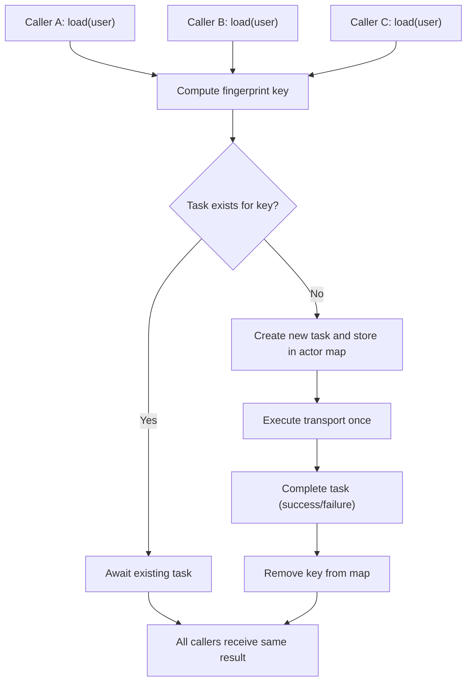

# In-Flight Deduplication в iOS: как убрать дубли сетевых запросов в production

Привет. В этой статье разберем инженерный паттерн, который часто дает быстрый и измеримый эффект в мобильных клиентах: **in-flight deduplication**.

Коротко: если несколько частей приложения одновременно делают один и тот же запрос, мы не отправляем его в сеть N раз, а выполняем один раз и раздаем результат всем ожидающим.

Статья обезличенная и подходит для внешней публикации.

---

## Введение: откуда берутся дубли

В реальном приложении конкурентные одинаковые запросы возникают постоянно:

- экран открывается и параллельно тянет несколько блоков;
- одна и та же сущность запрашивается в двух фичах;
- быстрые переходы между экранами повторно триггерят загрузку;
- prefetch и обычная загрузка пересекаются во времени.

В итоге backend видит несколько одинаковых HTTP-вызовов с разницей в миллисекунды. Это:

- лишний QPS на сервер;
- лишний радиомодуль и батарея на клиенте;
- более шумные метрики latency;
- больше случайных race-сценариев в UI.

---

## Что такое in-flight deduplication

Важно сразу отделить это от кеша.

**In-flight deduplication**:

- работает только пока запрос "в полете";
- не хранит ответ после завершения;
- не меняет бизнес-семантику данных;
- синхронизирует конкурентные одинаковые вызовы на один общий `Task`.

Это также называют request coalescing.

---

## Цель и контракт

Формализуем контракт механизма:

1. При вызове `run(key, operation)` система проверяет, есть ли активная задача для `key`.
2. Если есть, новый вызов ждет ее результат.
3. Если нет, создается новая задача и регистрируется в таблице активных.
4. Когда задача завершена, запись удаляется.
5. Успех или ошибка основной задачи распространяется на всех ожидающих.

Если эти пункты выполняются строго, вы гарантированно убираете параллельные дубли.

---

## Почему actor, а не lock

В Swift Concurrency естественное решение это `actor`:

- сериализованный доступ к таблице задач;
- проще проверять корректность;
- меньше риск тонких ошибок с lock/unlock;
- естественная совместимость с `async/await`.

---

## Архитектура в одном рисунке



---

## Реализация: Request Fingerprint (canonicalization + SHA-256)

Первая критичная часть это ключ. Нельзя просто брать "как есть" URL и body, иначе dedup либо не сработает, либо схлопнет лишнее.

### Что включать в ключ

- HTTP method;
- canonical URL;
- canonical body;
- auth scope (если данные зависят от пользователя/тенанта).

### Почему canonicalization

Если одинаковый смысл запроса представлен разным порядком полей или query-параметров, без normalizing вы получите разные ключи и dedup не сработает.

### Код

```swift
import Foundation
import CryptoKit

struct RequestFingerprint: Hashable, Sendable {
    let method: String
    let url: String
    let bodyDigest: String
    let authScopeDigest: String?

    var rawValue: String {
        [method.uppercased(), url, bodyDigest, authScopeDigest ?? ""].joined(separator: "|")
    }

    var key: String {
        SHA256.hex(rawValue)
    }

    static func make(
        method: String,
        url: URL,
        queryItems: [URLQueryItem]?,
        body: Data?,
        authScope: String?
    ) -> RequestFingerprint {
        let canonicalURL = URLCanonicalizer.canonicalURLString(url: url, queryItems: queryItems)
        let canonicalBody = BodyCanonicalizer.canonicalBody(body)
        let bodyDigest = SHA256.hex(canonicalBody)
        let authDigest = authScope.map(SHA256.hex)

        return RequestFingerprint(
            method: method,
            url: canonicalURL,
            bodyDigest: bodyDigest,
            authScopeDigest: authDigest
        )
    }
}

enum URLCanonicalizer {
    static func canonicalURLString(url: URL, queryItems: [URLQueryItem]?) -> String {
        guard var components = URLComponents(url: url, resolvingAgainstBaseURL: false) else {
            return url.absoluteString
        }

        if let queryItems, !queryItems.isEmpty {
            components.queryItems = queryItems.sorted {
                if $0.name == $1.name { return ($0.value ?? "") < ($1.value ?? "") }
                return $0.name < $1.name
            }
        }

        return components.url?.absoluteString ?? url.absoluteString
    }
}

enum BodyCanonicalizer {
    static func canonicalBody(_ body: Data?) -> Data {
        guard let body, !body.isEmpty else { return Data() }

        if
            let object = try? JSONSerialization.jsonObject(with: body),
            JSONSerialization.isValidJSONObject(object),
            let normalized = try? JSONSerialization.data(withJSONObject: object, options: [.sortedKeys])
        {
            return normalized
        }

        // Для не-JSON payload возвращаем исходные байты
        return body
    }
}

enum SHA256 {
    static func hex(_ string: String) -> String {
        hex(Data(string.utf8))
    }

    static func hex(_ data: Data) -> String {
        let digest = CryptoKit.SHA256.hash(data: data)
        return digest.map { String(format: "%02x", $0) }.joined()
    }
}
```

### Почему SHA-256, а не raw key

- ключ фиксированной длины;
- меньше аллокаций;
- безопаснее для логирования и метрик;
- не тащим большие body в память как строку.

---

## Реализация: InFlightRequests с cancellation policy

Вторая ключевая часть это поведение при отмене.

### Возможные политики

- `keepRunning`: если один caller отменился, общая задача продолжает работать.
- `cancelWhenNoWaiters`: если отменились все ожидающие, можно отменить транспортную задачу.

На практике `keepRunning` обычно безопаснее и проще для UI.

### Код

```swift
import Foundation

enum CancellationPolicy: Sendable {
    case keepRunning
    case cancelWhenNoWaiters
}

actor InFlightRequests<Output, Failure: Error> {
    private struct Entry {
        let task: Task<Result<Output, Failure>, Never>
        var waiters: Set<UUID>
    }

    private var entries: [String: Entry] = [:]
    private let policy: CancellationPolicy

    init(policy: CancellationPolicy = .keepRunning) {
        self.policy = policy
    }

    func run(
        key: String,
        operation: @Sendable @escaping () async -> Result<Output, Failure>
    ) async throws -> Output {
        let waiterID = UUID()
        let task = acquireTask(for: key, waiterID: waiterID, operation: operation)

        return try await withTaskCancellationHandler {
            let result = await task.value
            await waiterFinished(key: key, waiterID: waiterID)
            return try unwrap(result)
        } onCancel: {
            Task { [weak self] in
                await self?.waiterCancelled(key: key, waiterID: waiterID)
            }
        }
    }

    private func acquireTask(
        for key: String,
        waiterID: UUID,
        operation: @Sendable @escaping () async -> Result<Output, Failure>
    ) -> Task<Result<Output, Failure>, Never> {
        if var existing = entries[key] {
            existing.waiters.insert(waiterID)
            entries[key] = existing
            return existing.task
        }

        let task = Task { await operation() }
        entries[key] = Entry(task: task, waiters: [waiterID])
        return task
    }

    private func waiterCancelled(key: String, waiterID: UUID) {
        guard var entry = entries[key] else { return }
        guard entry.waiters.remove(waiterID) != nil else { return }

        if entry.waiters.isEmpty {
            if policy == .cancelWhenNoWaiters {
                entry.task.cancel()
            }
            entries[key] = nil
        } else {
            entries[key] = entry
        }
    }

    private func waiterFinished(key: String, waiterID: UUID) {
        guard var entry = entries[key] else { return }
        _ = entry.waiters.remove(waiterID)

        if entry.waiters.isEmpty {
            entries[key] = nil
        } else {
            entries[key] = entry
        }
    }

    private func unwrap(_ result: Result<Output, Failure>) throws -> Output {
        switch result {
        case .success(let output): return output
        case .failure(let failure): throw failure
        }
    }
}
```

---

## Интеграция в network layer

```swift
final class NetworkClient {
    private let inFlight: InFlightRequests<Data, NetworkError>
    private let transport: Transport

    init(
        transport: Transport,
        cancellationPolicy: CancellationPolicy = .keepRunning
    ) {
        self.transport = transport
        self.inFlight = InFlightRequests(policy: cancellationPolicy)
    }

    func load(request: APIRequest, authScope: String?) async throws -> Data {
        let fingerprint = RequestFingerprint.make(
            method: request.method.rawValue,
            url: request.url,
            queryItems: request.queryItems,
            body: request.body,
            authScope: authScope
        )

        return try await inFlight.run(key: fingerprint.key) { [transport] in
            await transport.execute(request)
        }
    }
}
```

---

## Edge cases: почему это важно и что делать

### 1. Не учитывать auth scope
Плохо: один и тот же endpoint для разных пользователей может схлопнуться в один запрос.  
Решение: включать tenant/user scope в fingerprint.

### 2. Нестабильный query order
Плохо: `?b=2&a=1` и `?a=1&b=2` станут разными ключами.  
Решение: сортировка query items.

### 3. JSON c разным порядком полей
Плохо: один смысл, разные ключи.  
Решение: canonical JSON через `.sortedKeys`.

### 4. Схлопывание неидемпотентных операций
Плохо: можно случайно изменить бизнес-семантику командных запросов.  
Решение: включать dedup по умолчанию для чтений (обычно GET), для write-only по явному контракту.

### 5. Отмена задач
Плохо: непрозрачная отмена может рвать поток данных.  
Решение: явно выбрать policy и зафиксировать ее в документации команды.

---

## Тесты: обязательный production-набор

Ниже каркас на `Swift Testing`.

```swift
import Testing
import Foundation

enum TestError: Error, Equatable { case failed }

actor CountingTransport {
    private(set) var callCount = 0
    var result: Result<Data, TestError> = .success(Data("ok".utf8))
    var delayNanos: UInt64 = 100_000_000

    func execute() async -> Result<Data, TestError> {
        callCount += 1
        try? await Task.sleep(nanoseconds: delayNanos)
        return result
    }

    func calls() -> Int { callCount }
}

@Suite
struct InFlightRequestsTests {
    @Test
    func coalescesConcurrentSuccess() async throws {
        let transport = CountingTransport()
        let inFlight = InFlightRequests<Data, TestError>()

        async let a = inFlight.run(key: "k") { await transport.execute() }
        async let b = inFlight.run(key: "k") { await transport.execute() }

        let (ra, rb) = try await (a, b)
        #expect(ra == rb)
        #expect(await transport.calls() == 1)
    }

    @Test
    func coalescesConcurrentFailure() async {
        let transport = CountingTransport()
        await transport.result = .failure(.failed)
        let inFlight = InFlightRequests<Data, TestError>()

        async let a: Void = {
            do { _ = try await inFlight.run(key: "k") { await transport.execute() } }
            catch { #expect((error as? TestError) == .failed) }
        }()

        async let b: Void = {
            do { _ = try await inFlight.run(key: "k") { await transport.execute() } }
            catch { #expect((error as? TestError) == .failed) }
        }()

        _ = await (a, b)
        #expect(await transport.calls() == 1)
    }

    @Test
    func startsNewCallAfterCompletion() async throws {
        let transport = CountingTransport()
        let inFlight = InFlightRequests<Data, TestError>()

        _ = try await inFlight.run(key: "k") { await transport.execute() }
        _ = try await inFlight.run(key: "k") { await transport.execute() }

        #expect(await transport.calls() == 2)
    }

    @Test
    func differentKeysDoNotCoalesce() async throws {
        let transport = CountingTransport()
        let inFlight = InFlightRequests<Data, TestError>()

        async let a = inFlight.run(key: "k1") { await transport.execute() }
        async let b = inFlight.run(key: "k2") { await transport.execute() }

        _ = try await (a, b)
        #expect(await transport.calls() == 2)
    }

    @Test
    func cancelWhenNoWaitersCancelsUnderlyingTask() async {
        let inFlight = InFlightRequests<Data, TestError>(policy: .cancelWhenNoWaiters)

        let task = Task {
            try await inFlight.run(key: "k") {
                try? await Task.sleep(nanoseconds: 5_000_000_000)
                return .success(Data())
            }
        }

        task.cancel()
        _ = await task.result
    }

    @Test
    func canonicalizationMakesStableFingerprintForJSONFieldOrder() async {
        let url = URL(string: "https://example.com/api")!
        let body1 = Data(#"{"b":2,"a":1}"#.utf8)
        let body2 = Data(#"{"a":1,"b":2}"#.utf8)

        let f1 = RequestFingerprint.make(method: "POST", url: url, queryItems: nil, body: body1, authScope: "scope")
        let f2 = RequestFingerprint.make(method: "POST", url: url, queryItems: nil, body: body2, authScope: "scope")

        #expect(f1.key == f2.key)
    }
}
```

### Что проверяют эти тесты

- `coalescesConcurrentSuccess`: основной инвариант dedup.
- `coalescesConcurrentFailure`: единая ошибка для всех ожидателей.
- `startsNewCallAfterCompletion`: это не кеш.
- `differentKeysDoNotCoalesce`: схлопывание только по эквивалентности.
- `cancelWhenNoWaiters...`: корректность policy отмены.
- `canonicalization...`: стабильность fingerprint для JSON.

---

## Метрики и наблюдаемость

Без метрик механизм трудно защищать в production. Минимум:

- `in_flight_hit` и `in_flight_miss`;
- `waiters_count` по ключу;
- распределение длительности запроса;
- top endpoints по hit ratio;
- частота отмен по policy.

Что это даст:

- видно реальную экономию сетевых вызовов;
- проще ловить регрессии после релиза;
- легче аргументировать включение механизма для новых фич.

---

## Rollout без риска

1. Включить feature flag.
2. Стартовать только на GET.
3. Запустить канареечный процент аудитории.
4. Сравнить до/после:
   - число транспортных вызовов;
   - latency;
   - error rate;
   - cancel rate.
5. Постепенно расширять rollout.
6. Для write-операций включать точечно, только при явной идемпотентности.

---

## Практические рекомендации

- Держите `RequestFingerprint` в одном месте, не размазывайте логику по сервисам.
- Явно документируйте `CancellationPolicy` на уровне network client.
- Не логируйте raw body в ключах и метриках.
- Добавьте load-тест на high contention (10-50 конкурентных вызовов).
- Не смешивайте dedup и response cache в одном компоненте. Это разные механики.

---

## Заключение

In-flight deduplication это небольшой по объему код, который обычно быстро окупается:

- меньше дублей в сеть;
- более предсказуемый клиент;
- чище картина в метриках;
- меньше случайной конкурентной нестабильности.

Критично не просто "добавить actor", а сделать три вещи правильно:

1. корректный fingerprint;
2. прозрачная cancellation-семантика;
3. тесты на конкурентность и cleanup.

Если это сделано, механизм можно спокойно катить в production и масштабировать на весь сетевой слой.
